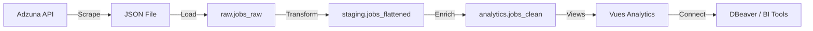

# 🚀 Guide de Configuration Apache Airflow

Ce guide vous explique comment configurer et utiliser Apache Airflow pour orchestrer le pipeline ETL JobMarket.

---

## 📋 Table des matières

1. [Vue d'ensemble](#vue-densemble)
2. [Prérequis](#prérequis)
3. [Installation et Démarrage](#installation-et-démarrage)
4. [Configuration de la connexion PostgreSQL](#configuration-de-la-connexion-postgresql)
5. [Utilisation du DAG](#utilisation-du-dag)
6. [Architecture du Pipeline](#architecture-du-pipeline)
7. [Dépannage](#dépannage)

---

## 🎯 Vue d'ensemble

**Airflow** est un orchestrateur de workflows qui va gérer automatiquement l'exécution de notre pipeline ETL dans le bon ordre :

```
Scraping Adzuna → Chargement RAW → Transformation STAGING → Transformation ANALYTICS → Vérification
```

### Avantages :
- ✅ **Automatisation complète** du pipeline
- ✅ **Interface web** pour suivre l'exécution
- ✅ **Retry automatique** en cas d'erreur
- ✅ **Logs détaillés** pour chaque tâche
- ✅ **Planification** (quotidienne, hebdomadaire, etc.)
- ✅ **Gestion des dépendances** entre tâches

---

## 🔧 Prérequis

### 1. Docker Desktop installé et démarré
Vérifiez que Docker est bien lancé :
```bash
docker --version
docker ps
```

### 2. PostgreSQL démarré (via docker-compose)
```bash
docker-compose up -d postgres
docker ps  # Vérifier que jobmarket_postgres est "Up (healthy)"
```

### 3. Configuration Adzuna API
Assurez-vous que `src/config.json` existe et contient vos clés API :
```json
{
  "adzuna": {
    "app_id": "VOTRE_APP_ID",
    "app_key": "VOTRE_APP_KEY"
  }
}
```

---

## 🚀 Installation et Démarrage

### Étape 1 : Démarrer tous les services Docker

```bash
# Depuis le répertoire racine du projet
cd C:\Users\dubas\Documents\JobMarket

# Démarrer PostgreSQL + Airflow
docker-compose up -d

# Vérifier que tout fonctionne
docker-compose ps
```

**Résultat attendu :**
```
NAME                    STATUS
jobmarket_airflow      Up (healthy)
jobmarket_postgres     Up (healthy)
```

### Étape 2 : Attendre l'initialisation d'Airflow

La première fois, Airflow doit initialiser sa base de données. Cela peut prendre 1-2 minutes.

**Suivre les logs :**
```bash
docker-compose logs -f airflow
```

**Attendez de voir :**
```
[...] Starting the scheduler...
[...] Starting the web server...
```

Vous pouvez arrêter le suivi des logs avec `Ctrl+C`.

### Étape 3 : Accéder à l'interface web Airflow

Ouvrez votre navigateur et allez sur :
```
http://localhost:8080
```

**Identifiants par défaut :**
- **Username** : `admin`
- **Password** : `admin`

---

## 🔗 Configuration de la connexion PostgreSQL

Pour que le DAG puisse exécuter les transformations SQL, il faut créer une connexion PostgreSQL dans Airflow.

### Option A : Via l'interface web (Recommandé)

1. **Connectez-vous** à Airflow : http://localhost:8080
2. Allez dans **Admin → Connections**
3. Cliquez sur **"+"** (Ajouter une connexion)
4. Remplissez les champs :

| Champ             | Valeur                    |
|-------------------|---------------------------|
| **Connection Id** | `jobmarket_postgres`      |
| **Connection Type** | `Postgres`              |
| **Host**          | `postgres`                |
| **Schema**        | `jobmarket`               |
| **Login**         | `jobmarket_user`          |
| **Password**      | `jobmarket_pass`          |
| **Port**          | `5432`                    |

5. Cliquez sur **Save**

### Option B : Via CLI (dans le conteneur)

```bash
docker exec -it jobmarket_airflow bash

airflow connections add 'jobmarket_postgres' \
    --conn-type 'postgres' \
    --conn-host 'postgres' \
    --conn-schema 'jobmarket' \
    --conn-login 'jobmarket_user' \
    --conn-password 'jobmarket_pass' \
    --conn-port 5432

exit
```

---

## ▶️ Utilisation du DAG

### 1. Vérifier que le DAG est visible

1. Allez sur http://localhost:8080
2. Vous devriez voir le DAG : **`jobmarket_etl_pipeline`**
3. Il est en **pause** par défaut (interrupteur gris)

### 2. Activer le DAG

Cliquez sur l'**interrupteur** à gauche du nom du DAG pour le passer en bleu (activé).

### 3. Lancer le DAG manuellement

1. Cliquez sur le **nom du DAG** : `jobmarket_etl_pipeline`
2. En haut à droite, cliquez sur le bouton **"▶️ Trigger DAG"**
3. Cliquez sur **"Trigger"** dans la popup

### 4. Suivre l'exécution

#### Vue graphique
Cliquez sur l'onglet **"Graph"** pour voir le pipeline :

```
start_pipeline → scrape_adzuna → load_to_postgres → transform_to_staging 
                                                    ↓
                                            transform_to_analytics
                                                    ↓
                                             verify_pipeline → end_pipeline
```

- 🟢 **Vert** = Tâche réussie
- 🔵 **Bleu** = Tâche en cours
- 🔴 **Rouge** = Tâche échouée
- ⚪ **Blanc** = Tâche en attente

#### Logs d'une tâche
1. Cliquez sur une tâche (ex: `scrape_adzuna`)
2. Cliquez sur **"Log"**
3. Vous verrez les logs en temps réel

### 5. Planification automatique (optionnel)

Pour exécuter le pipeline **automatiquement tous les jours à 6h du matin**, modifiez le DAG :

```python
# Dans dags/jobmarket_etl_pipeline.py
schedule_interval='0 6 * * *',  # Cron : tous les jours à 6h
```

Redémarrez Airflow :
```bash
docker-compose restart airflow
```

---

## 🏗️ Architecture du Pipeline

### Fichiers créés

```
JobMarket/
├── dags/
│   └── jobmarket_etl_pipeline.py    # DAG Airflow principal
├── src/
│   ├── scraper_adzuna.py           # Scraper Adzuna
│   ├── db_loader.py                # Chargeur PostgreSQL
│   ├── db_config.py                # Config DB centralisée
│   └── config.json                 # Clés API (GIT IGNORÉ)
├── sql/
│   ├── init/                       # Scripts d'initialisation DB
│   │   ├── 01_create_schemas.sql
│   │   ├── 02_create_raw_tables.sql
│   │   ├── 03_create_staging_tables.sql
│   │   ├── 04_create_analytics_tables.sql
│   │   └── 05_create_views.sql
│   └── transformations/            # Scripts de transformation
│       ├── 01_load_staging.sql     # RAW → STAGING
│       ├── 02_load_analytics.sql   # STAGING → ANALYTICS
│       └── 03_refresh_all.sql      # Refresh complet
├── data/                           # Données JSON (GIT IGNORÉ)
├── logs/                           # Logs Airflow
└── docker-compose.yml              # Config Docker
```

### Schéma du Pipeline



### Détail des tâches du DAG

| Tâche                   | Description                                | Durée estimée |
|-------------------------|--------------------------------------------|---------------|
| `start_pipeline`        | Marqueur de démarrage                      | < 1s          |
| `scrape_adzuna`         | Récupère les offres depuis Adzuna          | 5-15 min      |
| `load_to_postgres`      | Charge le JSON dans `raw.jobs_raw`         | 10-30s        |
| `transform_to_staging`  | Aplatit les données en colonnes SQL       | 5-10s         |
| `transform_to_analytics`| Enrichit avec calculs et flags            | 5-10s         |
| `verify_pipeline`       | Vérifie les données et affiche les stats  | 2-5s          |
| `end_pipeline`          | Marqueur de fin                            | < 1s          |

---

## 🔍 Vérification des résultats

### 1. Dans Airflow
Vérifiez les logs de la tâche `verify_pipeline` pour voir les statistiques :
```
📊 STATISTIQUES DU PIPELINE:
   🔍 Offres scrapées: 14000
   📥 Offres insérées (RAW): 14000
   🗃️  Import ID: 1

📋 TABLES POSTGRESQL:
   • raw.jobs_raw: 14000 lignes
   • staging.jobs_flattened: 14000 lignes
   • analytics.jobs_clean: 14000 lignes

✅ PIPELINE TERMINÉ AVEC SUCCÈS! 🎉
```

### 2. Dans DBeaver
Connectez-vous à PostgreSQL et exécutez :

```sql
-- Compter les lignes
SELECT COUNT(*) FROM raw.jobs_raw;
SELECT COUNT(*) FROM staging.jobs_flattened;
SELECT COUNT(*) FROM analytics.jobs_clean;

-- Vérifier les vues analytics
SELECT * FROM analytics.vw_salaries_by_job LIMIT 10;
SELECT * FROM analytics.vw_top_companies LIMIT 10;
SELECT * FROM analytics.vw_geo_distribution LIMIT 10;
```

---

## 🛠️ Dépannage

### Problème : Airflow ne démarre pas

**Symptôme :**
```bash
docker-compose ps
# jobmarket_airflow est "Restarting"
```

**Solution :**
```bash
# Voir les logs
docker-compose logs airflow

# Souvent, c'est un problème de mémoire. Augmentez la RAM de Docker (4GB minimum)
# Settings → Resources → Memory → 4GB

# Redémarrer
docker-compose restart airflow
```

### Problème : DAG n'apparaît pas dans l'interface

**Solutions :**
1. Vérifier que le fichier est bien dans `dags/`
2. Vérifier la syntaxe Python :
   ```bash
   docker exec -it jobmarket_airflow bash
   python /opt/airflow/dags/jobmarket_etl_pipeline.py
   exit
   ```
3. Forcer le refresh :
   ```bash
   docker-compose restart airflow
   ```

### Problème : Erreur `Connection 'jobmarket_postgres' not found`

**Solution :**
La connexion PostgreSQL n'est pas configurée. Suivez la section [Configuration de la connexion PostgreSQL](#configuration-de-la-connexion-postgresql).

### Problème : Erreur `No module named 'scraper_adzuna'`

**Solution :**
Le dossier `src/` n'est pas monté correctement. Vérifiez `docker-compose.yml` :
```yaml
volumes:
  - ./src:/opt/airflow/src
```

Redémarrez :
```bash
docker-compose down
docker-compose up -d
```

### Problème : Scraping échoue (clés API invalides)

**Solution :**
Vérifiez que `src/config.json` contient les bonnes clés :
```bash
cat src/config.json
```

Si vide ou incorrect, mettez à jour et redémarrez :
```bash
docker-compose restart airflow
```

### Problème : Impossible de se connecter à PostgreSQL depuis Airflow

**Solution :**
Vérifiez que PostgreSQL est bien démarré :
```bash
docker ps
# jobmarket_postgres doit être "Up (healthy)"

# Tester la connexion depuis le conteneur Airflow
docker exec -it jobmarket_airflow bash
psql -h postgres -U jobmarket_user -d jobmarket -c "SELECT 1;"
# Mot de passe : jobmarket_pass
exit
```

---

## 📊 Prochaines étapes

1. ✅ **Pipeline fonctionnel** : Vous avez un ETL automatisé de bout en bout
2. 🔄 **Planification** : Activez le `schedule_interval` pour automatiser quotidiennement
3. 📈 **Visualisation** : Connectez DBeaver ou un outil BI (Metabase, Superset, Power BI) aux vues analytics
4. 🧪 **Tests** : Ajoutez des tests de qualité de données (pytest + Great Expectations)
5. 📧 **Alertes** : Configurez les emails pour être notifié en cas d'échec

---

## 📚 Ressources

- [Documentation Apache Airflow](https://airflow.apache.org/docs/)
- [PostgreSQL Documentation](https://www.postgresql.org/docs/)
- [Guide DBeaver](./DBEAVER_SETUP.md)
- [Guide PostgreSQL](./DATABASE_SETUP.md)

---

**Félicitations ! Votre pipeline ETL avec Airflow est opérationnel !** 🎉

Pour toute question, consultez les logs ou ouvrez une issue sur le repository.

